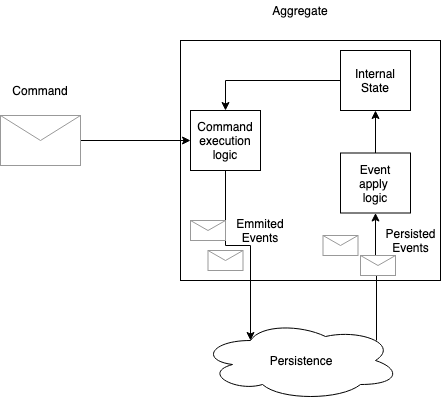

# Aggregates

An aggregate is a set of objects incapsulating the business behavior. 
According to DDD the aggregate should have a name from ubiquitos language, 
usually it is a business-specific name, like Order, Discount, User, and so on. 
Aggregate defines and protects its invariants, defining business rules. 
For example, an Order could be valid only if its Creator is set. 
Aggregates are a direct implication of OOP to business model. 
The idea is to mimic real business entities and their behavior. 

It is a key factor of success to define aggregates for you business model, 
there is a lot of books and articles about it. 

* [Martin Fauler: Aggregate](https://martinfowler.com/bliki/DDD_Aggregate.html)
* [Aggregates and entities](http://thepaulrayner.com/blog/aggregates-and-entities-in-domain-driven-design/)
* [What are the aggregates](https://culttt.com/2014/12/17/aggregates-domain-driven-design/)

Aggregates always have a behavior and can survive application restarts, e.g. could be persisted. An Aggregate lifetime is binded to lifetime of a business entity it plays. 

# Implementation 

There are a lot of different implementation of aggregates and how frameworks treat them. The classic one is via ORM and Repository patterns. Additional patterns like CQRS and Event Sourcing could be applied to.

The main point of any implementation is the separation of aggregates with business logic from details of the implementation - the application framework. 
Any framework will bring additional dependencies and pollute the idea of aggregates as a pure source of the domain behavior.

GridDomain follows this separation and uses interface-based aggregates. 
Any class implementing an [IAggregate](xref:GridDomain.Aggregates.Abstractions.IAggregate) interface could be used. 

## Aggregate operations flow

Aggregates in GridDomain accept commands as external input and produce events as an execution result. Events will be persisted and be passed back to the aggregate to modify its internal state. Then the cicle will repeat.

The commands and events are defined by the aggregate itself and form a major part of domain model. 

## Aggregates pool

  GridDomain thinks about Aggregates as entities, living somewhere in the abstract Aggregates pool. The user is not bothered with manual aggregates creation, it is handled by the framework, as well as aggregate lifecycle.

  To identify aggregates inside the pool, GridDomain uses an [aggregate address](xref:GridDomain.Aggregates.Abstractions.IAggregateAddress?title=IAggregateAddress) abstraction.  

  The address consist of the aggregate name, witch will be binded to a C# type, and the aggregate instance Id. Different aggregate names can reuse the same Ids. It is recommended to take business identifiers instead of artificial ones like GUID

## Commands 

  GridDomain uses term "command" with a specific meaning of "an aggregate command". A command is a request for an aggregate internal state modification. Aggregates define their commands, and have full control of the execution behavior. So a command belongs to the only one aggregate type and cannot be shared between different aggregate types. 
  GridDomain uses [ICommand](xref:GridDomain.Aggregates.Abstractions.ICommand?title=ICommand) interface to represent an aggregate command.  

## Executing commands 

  In normal flow, the aggregate will execute the incoming command and produce some events 
  as a result. If aggregate is not happy with the command it is free to throw business exceptions. These exceptions will be passed back to the command sender. In case of command error any changes to the aggregate are discarded and it is reverted to the state after the last sucessfull command. 

### Commands concurrency
Any aggregate can expect a single-threaded, not-concurrent execution of incoming commands. Commands targeting a single aggregate will be delivered to the aggregate one by one, waiting for produced events persistence and apply. 
Incoming commands will stack up in a in-memory queue and passed for the execution when the aggregate is ready. 

### Commands idempotency
  
  Each command have an unique, auto-generated Id. It is used to support command idemponetce, 
  a guarantee that any command will be executed at most one by the target aggregate. Only successfully command executions counts. So a failing command could be sent many times for the execution. For example, in case of command execution timeout, it is safe to resend the command few times until a sucessfull execution or "[already executed](xref:GridDomain.Aggregates.Abstractions.CommandAlreadyExecutedException)" error.  

## Raising events 

  An aggregate can raise any number of [events](xref:GridDomain.Aggregates.Abstractions.IDomainEvent) as a result of command execution. 
  The meaning of the events and content is determined by the aggregate. 
### Command result
### Version conventions
### Applying events before persistence 

## Building the internal state

### Events apply contract
### Events auto-apply after persistence
### Snapshots
### Aggregate creation

## Persistence contract

###All-or-nothing
###Handling the event apply errors

## Aggregates lifetime

