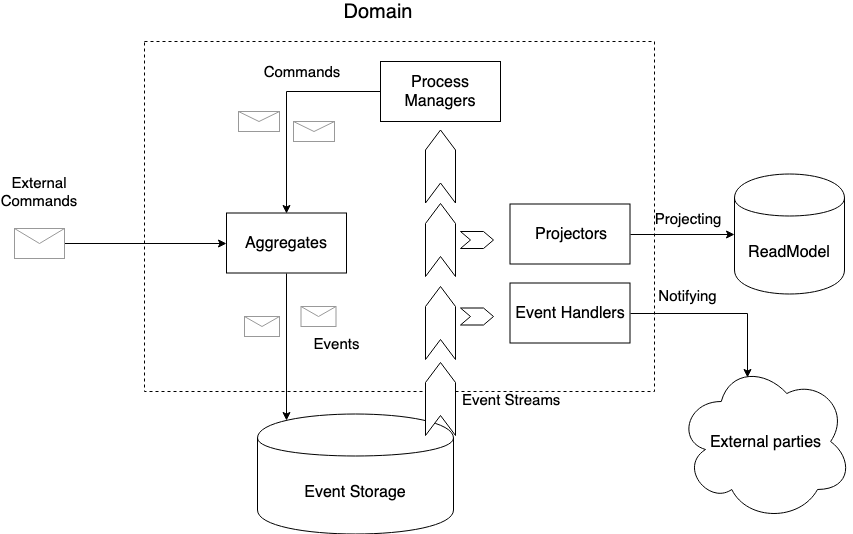

# Domains

The business domain is one of the core concepts in GD. 
It includes business rules and behavior, forming the business model in a given bounded context. 
The domain could be treated as a black box, accepting commands as input and exposing projections with notifications as command execution result. 

Domain encapsulates:

* [aggregates](aggregates.md) 
* [projections](projections.md)
* [process managers](process_managers.md)
* [event handlers](event_handlers.md)
   
Data flow is standard for CQRS with Event Sourcing:

