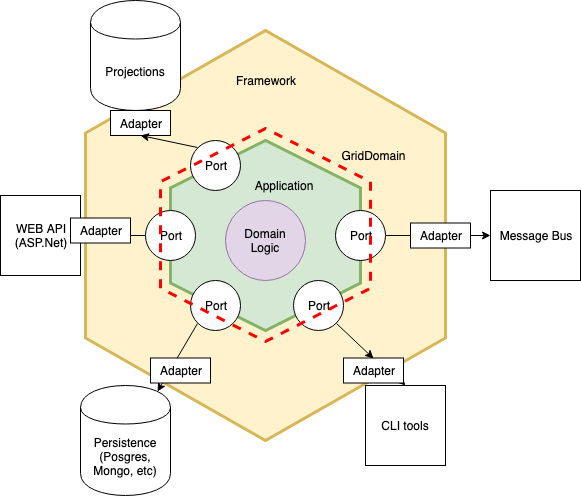

# Introduction

GridDomain is a framework for building robust, scalable and reliable applications with ease and focus on the domain and not the framework powering it.
It is about the simplicity of business (domain) knowledge and models implementation. 
GridDomain suggests a way for developers to think about the domain model as a top priority concept, taking care of the underlying engine.
The engine is implemented with community proven concepts as CQRS, Event Sourcing, and DDD and actor models, but GridDomain allows to create rich domain models without external dependencies and keep the complex stuff out of the brackets.    
Feel free to jump directly to [quickstart guide](quickstart.md)

# Assumptions
We assume our readers are aware of Domain Driven Design main concepts and we will use the same terminology. 
If you are new to DDD, we kindly advise you to unveil this wonderful world with the following articles: 

[DDD in 10 minutes](https://ethomasjoseph.com/developerhub/blog/2009/03/domain-driven-design-in-10-minutes_31.html)
 
For a more detailed approach feel free to visit References

# GridDomain in your application
  
 GridDomain is built to be the heart of an application, regardless of its type, web or desktop. It is built to implement the domain itself and the business model. In [hexagonal arhitecture](https://fideloper.com/hexagonal-architecture) it will the the 
 core domain layer and the application layer.

 

 GridDomain supports clustering as a first-class citizen and uses [stateful service design](https://petabridge.com/blog/stateful-web-applications/) powered by [Akka.Net](https://getakka.net/articles/intro/what-is-akka.html) actor framework.  

